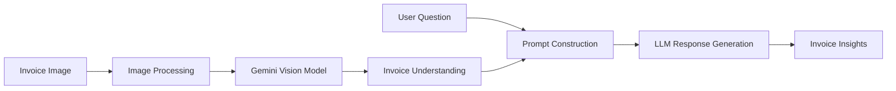

# AI-Powered Invoice Understanding System

An AI-powered document intelligence application that extracts and analyzes information from invoice images using Google's Gemini Vision model.

The system enables users to upload invoice documents and ask natural language questions about invoice content, simplifying invoice review and information extraction workflows.

---

## Business Problem

Organizations process large volumes of invoices containing important financial and operational information.

Manually reviewing invoices can be:

* Time-consuming
* Error-prone
* Resource-intensive
* Difficult to scale

Common invoice processing tasks include:
 
* Identifying vendor information
* Extracting invoice numbers
* Reviewing billing details
* Verifying invoice amounts
* Understanding payment information

Automating these activities can improve efficiency and reduce manual effort.

---

## Project Goal

Develop an AI-powered assistant capable of:

* Understanding invoice images
* Extracting invoice details
* Answering user questions about invoice content
* Providing invoice insights through natural language interactions

---

## Solution Overview

The application combines image understanding capabilities with Large Language Models (LLMs) to analyze invoice documents.

Users upload an invoice image and submit questions. The system processes the image using Gemini Vision and generates context-aware responses based on the invoice content.

---

# Architecture



---

## End-to-End Workflow

### Invoice Processing

1. User uploads an invoice image.
2. The image is processed and sent to Gemini Vision.
3. Invoice content is analyzed.
4. Key invoice information is interpreted by the model.

### Question Answering

1. User submits a question.
2. Invoice content and user query are combined into a prompt.
3. Gemini generates a response.
4. The answer is displayed to the user.

---

## Key Features

### Invoice Understanding

Analyzes invoice images and interprets document content.

### Natural Language Question Answering

Allows users to ask questions about uploaded invoices.

### Visual Document Analysis

Processes invoice images directly without requiring manual data entry.

### Generative AI-Powered Insights

Uses Gemini Vision to generate contextual responses.

### Interactive Web Interface

Provides a simple Streamlit interface for invoice uploads and analysis.

---

## Example Questions

Users can ask questions such as:

```text
What is the invoice number?
```

```text
Who is the vendor?
```

```text
What is the total payable amount?
```

```text
What is the invoice date?
```

```text
What payment terms are mentioned?
```

---

## Example Workflow

### User Uploads

```text
Invoice_001.jpg
```

### User Question

```text
What is the total invoice amount?
```

### Generated Response

```text
The total invoice amount is ₹52,480.
```

---

## Architecture Components

| Component           | Responsibility                          |
| ------------------- | --------------------------------------- |
| Streamlit UI        | User interaction                        |
| Image Upload Module | Accept invoice images                   |
| Gemini Vision       | Analyze invoice content                 |
| Prompt Layer        | Combine invoice context with user query |
| Response Engine     | Generate answers                        |
| Output Layer        | Display invoice insights                |

---

## Project Structure

```text
AI-Powered-Invoice-Scanner/

├── app.py
├── requirements.txt
├── .env
├── README.md
│
├── assets/
│
├── sample_invoices/
│
└── screenshots/
```

---

## Technology Stack

### Programming Language

* Python

### Generative AI

* Google Gemini Vision

### Web Application

* Streamlit

### Image Processing

* Pillow (PIL)

### Environment Management

* Python Dotenv

---

## Technical Concepts Demonstrated

* Generative AI
* Multimodal AI
* Vision-Language Models
* Document Intelligence
* Prompt Engineering
* Image Understanding
* Invoice Analysis
* Streamlit Application Development
* AI-Powered Question Answering

---

## Supported File Formats

The application supports:

* JPG
* JPEG
* PNG

---

## Getting Started

### Clone Repository

```bash
git clone https://github.com/<your-username>/AI-Powered-Invoice-Scanner.git
cd AI-Powered-Invoice-Scanner
```

### Create Virtual Environment

```bash
python -m venv .venv
```

### Activate Environment

Windows:

```bash
.venv\Scripts\activate
```

Linux/macOS:

```bash
source .venv/bin/activate
```

### Install Dependencies

```bash
pip install -r requirements.txt
```

### Configure Environment Variables

Create a `.env` file:

```env
GOOGLE_API_KEY=your_google_api_key
```

### Run Application

```bash
streamlit run app.py
```

### Open Application

```text
http://localhost:8501
```

---

## Use Cases

* Invoice Review Automation
* Vendor Information Extraction
* Financial Document Analysis
* Accounts Payable Support
* Invoice Validation Workflows
* Intelligent Document Processing (IDP)

---

## Sample Technology Workflow

```text
Invoice Image
      ↓
Gemini Vision
      ↓
Invoice Understanding
      ↓
User Question
      ↓
Prompt Construction
      ↓
AI Response
      ↓
Invoice Insights
```
